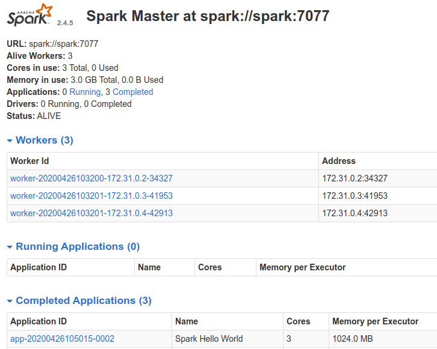

# Data Engineer: Coding Exercise

## Problem

Implement an Airflow ([Apache Airflow](https://airflow.apache.org/)) DAG to process data from two separate sources and merge it into a single output file.  The DAG should run on a daily basis.  For the purpose of the exercise, both input and output can use the local file system.

Folders `input_source_1/` and `input_source_2/` will contain the input data. 
You can assume that a new file will appear daily in each of those folders, with the filename specifying the date of the data it contains. 
Source 1 data is expected to arrive between 1-3am the following day, in JSON format, while Source 2 data is expected to arrive between 4-5am, in CSV format (e.g. data_20210125.json will appear in the folder on January 26th between 1am and 3am, and engagement_20210125.csv will appear on January 26th between 4am and 5am).
See the sample files provided to familiarise yourself with their format and structure.

The DAG should write to a CSV file the following: date, post id, shares, comments, and likes. All other fields should be ignored.  

Although the sample files are small, your program should be designed such that it could be used in the future to merge large files.

It is totally permitted to make use of any sample code, libraries or other resources available on the internet. Directly copying someone else's answer to this exact question is not advisable.

## Summary

1. Used microservices to setup airflow with spark on local [Setup](#setup)

2. All data is kept in ./data - input data in `input_source_1` and `input_source_2` and output in `output` folder 

3. Airflow dag is kept in `dags` folder `/dags/data_pipeline_dag.py`

4. Data processing script is kept in  `spark/app/data_combine.py`

5. Output is kept in folder `data/output`

6. Airflow dag: We can execute dag with backfill date manually from 25 Jan 2020 to run for this file.

7. The expectation is that dag is setup to execute after both files are landed. We need to align this with business.  

8. Reasons to choose Spark: The spark in python was chosen from a perspective that if data grows in later we can scale the solution

9. Below are the things to make it more robust:
- Add error handling in terms of filenames
- Error handling for schema
- Airflow dag needs to be more productionalised 

## Setup

This project contains the following containers:

* postgres: Postgres database for Airflow metadata and a Test database to test whatever you want.
    * Image: postgres:9.6
    * Database Port: 5432
    * References: https://hub.docker.com/_/postgres

* airflow-webserver: Airflow webserver and Scheduler.
    * Image: docker-airflow-spark:1.10.7_3.0.1
    * Port: 8282

* spark: Spark Master.
    * Image: bitnami/spark:3.0.1
    * Port: 8181
    * References: https://github.com/bitnami/bitnami-docker-spark

* spark-worker-N: Spark workers. You can add workers copying the containers and changing the container name inside the docker-compose.yml file.
    * Image: bitnami/spark:3.0.1
    * References: https://github.com/bitnami/bitnami-docker-spark

* jupyter-spark: Jupyter notebook with pyspark for interactive development.
  * Image: jupyter/pyspark-notebook:3.0.1
  * Port: 8888
  * References: 
    * https://jupyter-docker-stacks.readthedocs.io/en/latest/using/selecting.html#jupyter-pyspark-notebook
    * https://hub.docker.com/r/jupyter/pyspark-notebook/tags/

### Architecture components

### Setup

#### Build airflow Docker

Inside the airflow-spark/docker/docker-airflow

    $ docker build --rm --force-rm -t docker-airflow-spark:1.10.7_3.0.1 .

If you change the name or the tag of the docker image when building, remember to update the name/tag in docker-compose file.

#### Build Jupyter docker

Inside the airflow-spark/docker/docker-jupyter

    $ docker build --rm --force-rm -t jupyter/pyspark-notebook:3.0.1 .

If you change the name or the tag of the docker image when building, remember to update the name/tag in docker-compose file.

#### Start containers

Navigate to airflow-spark/docker and:

    $ docker-compose up

If you want to run in background:

    $ docker-compose up -d

Note: when running the docker-compose for the first time, the images postgres:9.6 and bitnami/spark:3.0.1 will be downloaded before the containers started.

#### Check if you can access

Airflow: http://localhost:8282

Spark Master: http://localhost:8181

PostgreSql - Database Test:

* Server: localhost:5432
* Database: test
* User: test
* Password: postgres

Postgres - Database airflow:

* Server: localhost:5432
* Database: airflow
* User: airflow
* Password: airflow

Jupyter Notebook: http://127.0.0.1:8888
  * For Jupyter notebook, you must copy the URL with the token generated when the container is started and paste in your browser. The URL with the token can be taken from container logs using:
  
        $ docker logs -f docker_jupyter-spark_1

### How to run a DAG to test

1. Configure spark connection acessing airflow web UI http://localhost:8282 and going to Connections
   

2. Edit the spark_default connection inserting `spark://spark` in Host field and Port `7077`
    

3. Run the spark-test DAG
   
4. Check the DAG log for the task spark_job. You will see the result printed in the log
   

5. Check the spark application in the Spark Master web UI (http://localhost:8181)
   

### Useful docker commands

    List Images:
    $ docker images <repository_name>

    List Containers:
    $ docker container ls

    Check container logs:
    $ docker logs -f <container_name>

    To build a Dockerfile after changing sth (run inside directoty containing Dockerfile):
    $ docker build --rm -t <tag_name> .

    Access container bash:
    $ docker exec -i -t <container_name> /bin/bash

### Useful docker-compose commands

    Start Containers:
    $ docker-compose -f <compose-file.yml> up -d

    Stop Containers:
    $ docker-compose -f <compose-file.yml> down --remove-orphans
